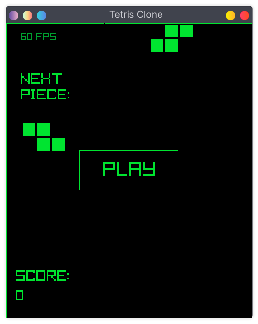

# Tetris Clone (C + raylib)

A simple Tetris clone written in **C** using **raylib**.  
Built mainly as a small project to learn raylib and practice C.

## Play Online
[Play now](https://sharmarahul111.github.io/tetris-clone-raylib/)



## Controls
- **Left / Right Arrow** — move piece
- **Up Arrow** — rotate piece
- **Down Arrow** — speed up falling block
- **Space** — pause game

No touch controls for mobile players 🥲

## Note
This game has sound effects, so adjust your volume if needed 😄

---

# Build Instructions

## Linux
**Requirements:** `gcc`, `raylib`

```bash
# build
make build

# run
make run
````

---

## Web (Emscripten)

**Requirements:** `emsdk`, `raylib` compiled for web

```bash
# edit raylib path if needed
cd docs/

emcc ../src/main.c ../src/controls.c ../src/pieces.c \
raylib/src/libraylib.web.a \
-Iraylib/src \
-s USE_GLFW=3 \
-s ASSERTIONS=0 \
-DPLATFORM_WEB \
-s EXIT_RUNTIME=1 \
-O3 \
--shell-file ./shell.html \
-o index.html \
--preload-file ../assets
```

---

## Windows (cross-compile on Linux)

```bash
# edit raylib path if needed
x86_64-w64-mingw32-gcc src/main.c src/controls.c src/pieces.c -o tetris-clone-windows.exe \
-Iraylib-for-windows/raylib/src \
-Lraylib-for-windows/raylib/src \
raylib-for-windows/raylib/build/raylib/libraylib.a \
-lopengl32 -lgdi32 -lwinmm
```

---

## Disclaimer

This project is an educational clone inspired by Tetris.

Tetris is a trademark of The Tetris Company.
This project is not affiliated with or endorsed by The Tetris Company.
